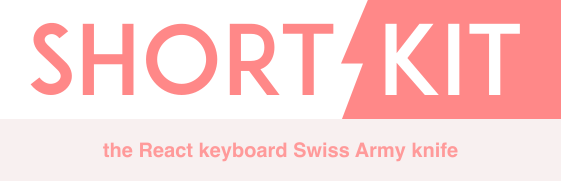

<p align="center">
  
</p>

---

[](https://www.npmjs.com/package/shortkit) [](https://standardjs.com)

## Install

```bash
npm i shortkit
```

## Usage

```js
import React from 'react'
import { useShortcut, ShortkitProvider } from 'shortkit'

const MyComponent = () => {
  useShortcut('c', () => {
    // Create a new document
  }, { fireInInputs: false })

  return someGubbins
}

const App = () => {
  return (
    <ShortkitProvider>
      <MyComponent />
    </ShortkitProvider>
  )
}
```

For more advanced usage, and to learn why Shortkit offers so much more
awesomeness than similar libraries, check out the [docs](./assets/api-reference.md).

---

<h6 align="center">
by Adam Soutar
</h6>

<p align="center">
  ⌨️ + ⚡️ = 😍
</p>
